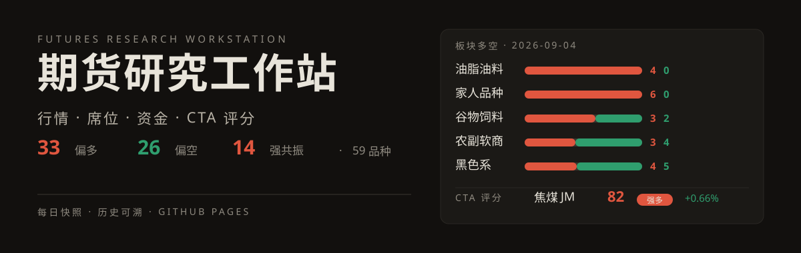

# 期货研究工作站

  

纯静态站点：行情、席位、资金、CTA 评分。个人复盘数据存私有数据仓（futures-journal-data），不在此公开仓。

- 源码与数据生产：EvanYFM/trading-system
- 更新方式：构建产物 push 到本仓 main，GitHub Pages 约 1 分钟自动上线
- 每日更新与发布检查：[`docs/daily-data-update-handoff.md`](docs/daily-data-update-handoff.md)
